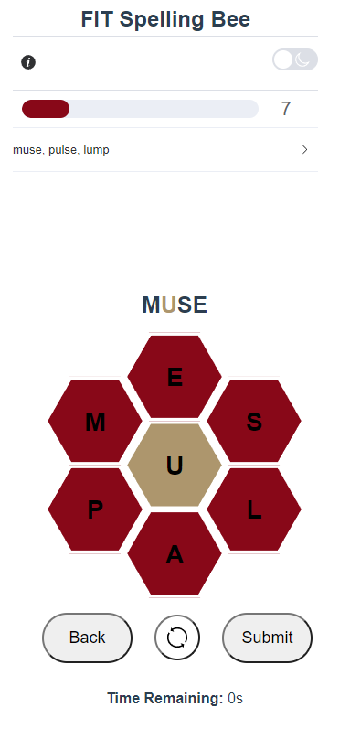

# Florida Tech's Spelling Bee Game

Developed by: Andres Esperandio, Arianna Issitt, and Matthew Delgado<br>
CSE 2410: Introduction to Software Engineering<br>
Professor: Dr. Khaled Salhoub<br>
GSA: Richard Diaz<br>
April 26th, 2023

# Assignment

Final project milestone will showcase work by demonstrating new features added to the chosen project.

# About

- Open source project for a puzzle game clone of The New York Times' Spelling Bee game.
- Originally a terminal-based Python game
- Currently is a cross-platform application with a GUI created using Vue.

## How to Play

Create words using letters from the hive:

- Words must contain at least 4 letters.
- Words must include the center letter.
- Letters can be used more than once.

Score points to increase your rating:

- 4-letter words are worth 1 point each.
- Longer words earn 1 point per letter.
- Each puzzle includes at least one “pangram” which uses every letter. These are worth 7 extra points!

## Before: Gameplay

```
Type !help or !h for help
Playing puzzle index: 1
Your letters are:
            _____
           /     \
          /       \
    ,----(    N    )----.
   /      \       /      \
  /        \_____/        \
  \   H    /     \    U   /
   \      /       \      /
    )----(    R'   )----(
   /      \       /      \
  /        \_____/        \
  \   G    /     \    D   /
   \      /       \      /
    `----(    O    )----'
          \       /
           \_____/

Max score: 88
Total words: 37
Your guess: GROUND
✓ GROUND              word score = 3        words found = 1/37    total score = 3/88
```

# After: Gameplay



## Build Setup

```shell
# install dependencies
yarn install

# dev server
yarn dev

yarn build
```
